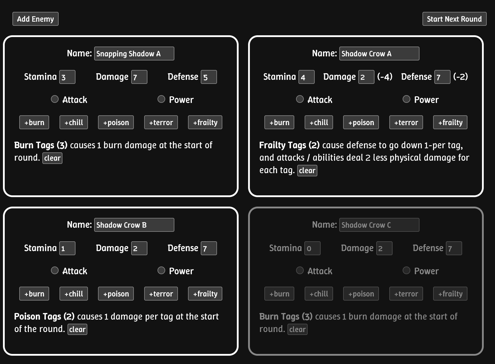
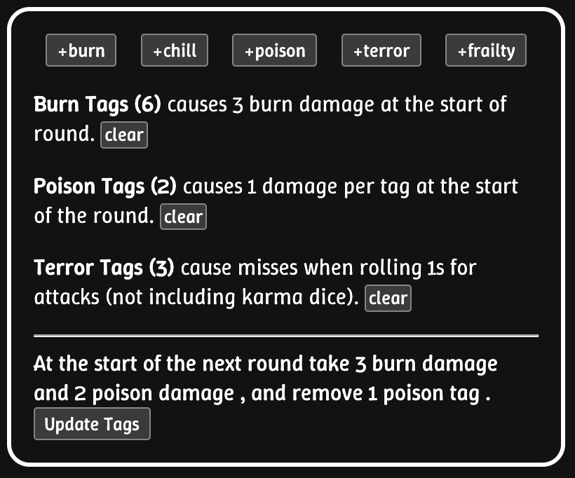

# Ink Status Tracker

Status Trackers for the [ink tabletop roleplaying game by Snowbright Studios](https://www.snowbrightstudio.com/ink).

For [Tracking Enemies](https://jrjurman.com/ink-status-tracker/enemies.html) or [for players](https://jrjurman.com/ink-status-tracker/player.html).

## Development

To build the custom `ink-status-description` component, update the `.html` file, and then run `npm run build` to build the `.js` version used in the pages.
